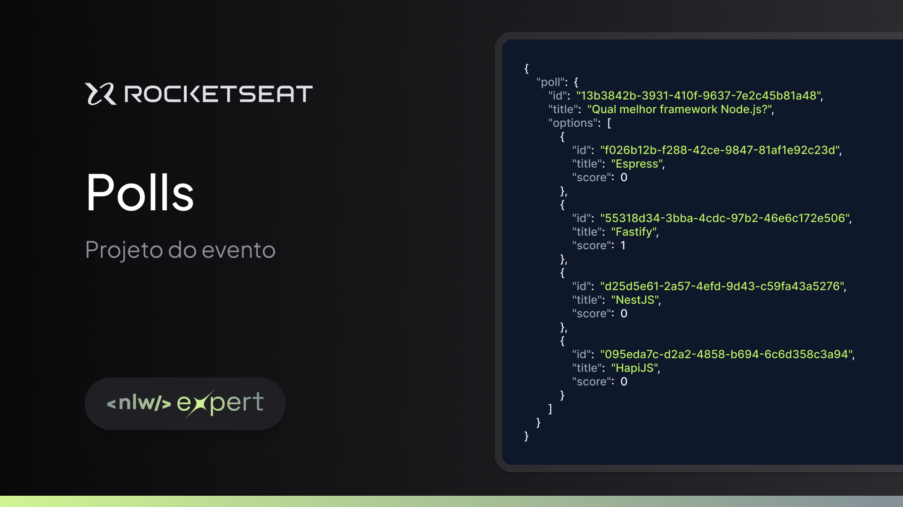

# NLW Expert - Trilha Node.js

Essa aplicação foi desenvolvida durante o NLW Experts da Rocketseat utilizando Node.js, TypeScript, Prisma.

## Tecnologias Utilizadas

- [Fastify](https://fastify.dev)
- [Node.js](https://nodejs.org/)
- [TypeScript](https://www.typescriptlang.org)
- [Prisma](https://www.prisma.io)
